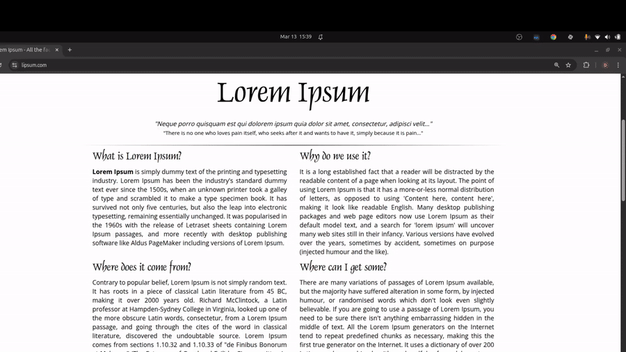
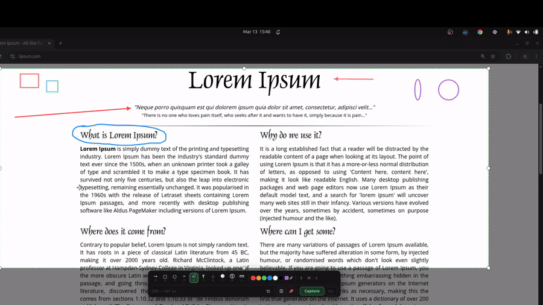
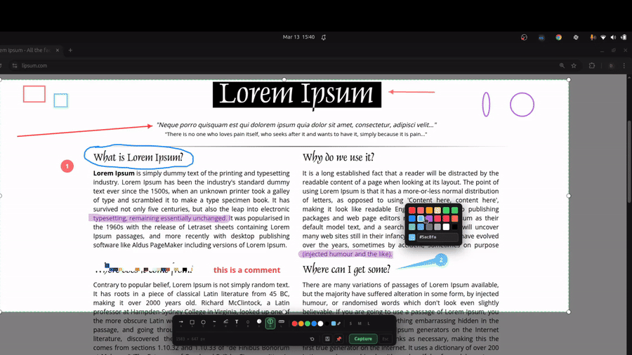

<div align="center">
    <a href="https://youtu.be/4MWk-g5m8YM">
        
    </a>

# Aurora Screenshots

A Linux desktop app for screen capture with annotation tools and clipboard history. Built with Rust & Tauri v2.

</div>

## Features

- **Area capture** — select any region of the screen with a crosshair overlay
- **Annotation editor** — draw arrows, rectangles, freehand marker, text, and blur regions on the capture before saving
- **Pin screenshot** — float a captured region as a borderless always-on-top window for quick visual comparisons
- **Clipboard history** — automatically stores captured images in a local SQLite database with thumbnail previews
- **Copy to clipboard** — one-click copy of any item from history or any pinned window
- **System tray** — lives in the tray, no taskbar clutter; accessible via tray menu or global shortcut
- **Global shortcut** — `Ctrl+Shift+S` from anywhere to open the capture overlay
- **Multi-monitor support** — overlay covers all monitors, coordinates correctly mapped across the virtual desktop

## What's new in v0.3.0

- **Extended annotation toolset** — circle/ellipse, freehand marker, highlighter, color inversion, and pixel ruler tools join the existing set.
- **Numbered bubble indicators** — add auto-incrementing numbered bubbles for step-by-step callouts, with a draggable tail pointer.
- **Keyboard shortcuts for tools** — switch tools instantly without touching the toolbar: `A` Arrow · `S` Rectangle · `C` Circle · `P` Marker · `H` Highlight · `T` Text · `B` Blur · `I` Invert · `N` Bubble · `L` Ruler.
- **Resizable selection** — fine-tune your selection after drawing it using 8 resize handles before annotating or capturing.
- **Right-click color picker** — right-click anywhere on the overlay to open a floating color palette at your cursor, with preset swatches and a hex input field.
- **System notifications** — a desktop notification confirms each successful capture.
- **ESC always closes** — ESC now exits the overlay immediately from any state, including mid-annotation.
- **Fixed**: first keypress after re-opening the overlay was swallowed, requiring two keypresses to act.
- **Fixed**: black screen on second capture after closing with ESC.

---

## Demo
<div>
<p align="center">
  
</p>


<p align="center">
  
</p>


<p align="center">
    
</p>
</div>

## Stack

| Layer | Technology |
|---|---|
| Desktop runtime | Tauri v2 |
| Backend | Rust |
| Frontend | React 19 + TypeScript + Vite |
| Styling | Tailwind CSS v4 |
| Database | SQLite via `rusqlite` (bundled) |
| State management | Zustand |
| X11 capture | `screenshots` crate |
| Wayland capture | `ashpd` (XDG portal) |
| Clipboard | `arboard` |
| Input grab | `x11rb` |

## Installation

Download the latest `.tar.gz` from [Releases](../../releases), extract and run the installer:

```bash
tar -xzf aurora-screenshots-*-linux-x86_64.tar.gz
cd aurora-screenshots-*
./install.sh
```

The installer copies the binary to `~/.local/bin`, registers the icons and creates a launcher in your application menu. No root required.

> Make sure `~/.local/bin` is in your `PATH`. On most distros it is added automatically; if not, add `export PATH="$HOME/.local/bin:$PATH"` to your `~/.bashrc` or `~/.zshrc`.

## Requirements

- Linux (X11 or Wayland)
- Node.js 18+
- Rust + Cargo
- [Tauri v2 system dependencies](https://v2.tauri.app/start/prerequisites/)

## Development

```bash
npm install
npm run tauri dev
```

## Build release tarball

```bash
./scripts/build-dist.sh
# → dist/aurora-screenshots-0.1.0-linux-x86_64.tar.gz
```

## Keyboard shortcuts

| Shortcut | Action |
|---|---|
| `Ctrl+Shift+S` | Open capture overlay |
| `Ctrl+C` | Capture selected area |
| `Ctrl+Z` | Undo last annotation |
| `Escape` | Cancel / close overlay |

## Support

If AuroraWall saves you from a boring desktop, consider supporting development:

<div align="center">

[](https://ko-fi.com/daniacostadev)

</div>

---

<div align="center">

Made with ❤️ and Rust · MIT License · [Ko-fi](https://ko-fi.com/daniacostadev)

</div>

Created by [@daniacosta-dev](https://github.com/daniacosta-dev)